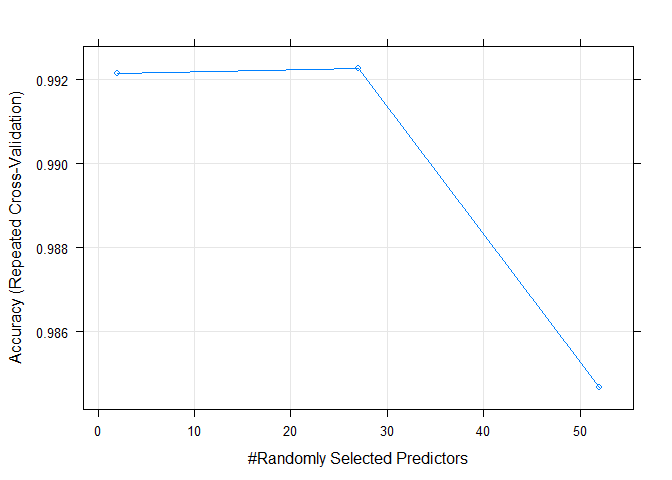
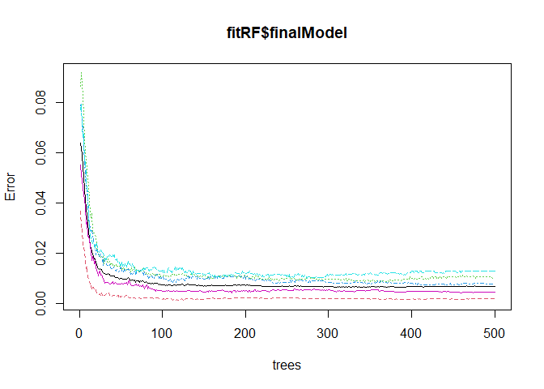
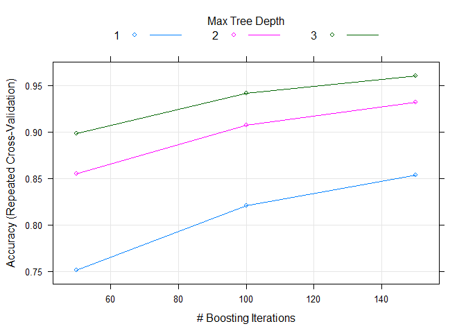
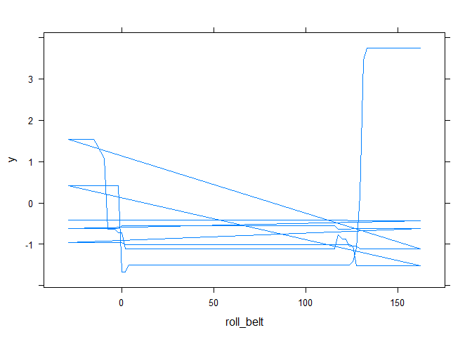

# Report

## Overview

This report describes the prediction assignment of the Practical Machine Learning - Coursera course from Johns Hopkins University. The goal of this project was to  predict the manner in which the recorded subjects exercised. This is represented by the "classe" variable in the training set.

In order to do this, the necessary data was downloaded and processed into R. Also, data sets were prepared, cleaned and partitioned.

Then, 5 different models were proposed and compared, to select one final model, Random Forests, to create prediction classe values for the 20 test cases provided.

## Preparing data

### Loading data

First the required data sets (pml-training and pml-testing) were downloaded and loaded into R.


```r
##download.file(url = 'https://d396qusza40orc.cloudfront.net/predmachlearn/pml-training.csv', 'pml-training.csv', method = 'curl')
##download.file(url = 'https://d396qusza40orc.cloudfront.net/predmachlearn/pml-testing.csv', 'pml-testing.csv', method = 'curl')
pmltraining = read.table('pml-training.csv', sep = ',', header = TRUE, na.strings = c('NA', '#DIV/0!', ''))
pmltesting = read.table('pml-testing.csv', sep = ',', header = TRUE, na.strings = c('NA', '#DIV/0!', ''))
pmltraining$classe = as.factor(pmltraining$classe)
pmltraining$cvtd_timestamp = as.Date(pmltraining$cvtd_timestamp, "%d/%m/%Y %H:%M")
```

### Splitting pmltraining data set into a model training and testing sets

Then, an actual model training and testing partition of the pmltraining data set was created for additional cross-validation. A specific seed was also setup for reproducibility purposes.


```r
## Setting seed for reproducibility purposes
set.seed(100)
## Creating model training partition
modTrainingPartition = createDataPartition(y = pmltraining$classe, p = 0.75, list = FALSE)
pmlmodeltraining = pmltraining[modTrainingPartition, ]
pmlmodeltesting = pmltraining[-modTrainingPartition, ]
pmlmodeltrainingclasse = pmlmodeltraining$classe
pmlmodeltestingclasse = pmlmodeltesting$classe
```

## Data cleaning

The code below helped cleaning up variables with near zero variance (very little variation), as well as high proportion (greater than or equal to 95%) of NA values across the entire model training data set. It is assumed that none of this would really be helpful for prediction purposes.


```r
## Clearing variables with near zero variance as bad predictors
pmlmodeltraining = pmlmodeltraining[, -nearZeroVar(pmlmodeltraining)]
## Clearing variables with more than 95% of NA values
pmlmodeltraining = pmlmodeltraining[, ((colSums(is.na(pmlmodeltraining))/nrow(pmlmodeltraining)) <= 0.95)]
```

Also, other non-relevant and subject-specific variables such as  X (number of the observation), user_name, num_window, as well as some timestamps columns were removed. Then, int values were converted to numerical in order to facilitate all calculations.  


```r
## Removing non relevant columns, and outcome
pmlmodeltraining = pmlmodeltraining[, -c(1:6, 59)]
## Leaving only columns present in the pmlmodel training data set into the testing and validation set
pmlmodeltesting = pmlmodeltesting[, names(pmlmodeltraining)]
pmltesting = pmltesting[, names(pmlmodeltraining)]
## Converting all predictors to numeric
pmlmodeltraining = data.frame(sapply(pmlmodeltraining, as.numeric))
pmlmodeltesting = data.frame(sapply(pmlmodeltesting, as.numeric))
pmltesting = data.frame(sapply(pmltesting, as.numeric))
```

## Model fitting

Once the data sets had been prepared, the following models were tried using repeated cross-validation with 10-fold and 3 repeats:

1. Decision Tree: rpart

2. Linear Discriminant Analysis: lda

3. Naive Bayes: nb

4. Gradient Boosting Trees: gbm

5. Random Forests: rf


```r
## Cross validation settings : 10 folds repeat 3 times
control = trainControl(method = 'repeatedcv', number = 10, repeats = 3)
## Fitting the different proposed models
fitTreeCARET = train(classe ~ ., data = cbind(classe = pmlmodeltrainingclasse, pmlmodeltraining),
        method = 'rpart', trControl = control) 
fitLDA = train(classe ~ ., data = cbind(classe = pmlmodeltrainingclasse, pmlmodeltraining),
        method = 'lda', trControl = control)
fitNB = train(classe ~ ., data = cbind(classe = pmlmodeltrainingclasse, pmlmodeltraining), 
        method = 'nb', trControl = control)
fitGBM = train(classe ~ ., data = cbind(classe = pmlmodeltrainingclasse, pmlmodeltraining), 
        method = 'gbm', trControl = control, verbose = FALSE)
fitRF = train(classe ~ ., data = cbind(classe = pmlmodeltrainingclasse, pmlmodeltraining), 
        method = 'rf', trControl = control)
```

After fitting the proposed models, confusion matrixes were calculated for the training and test data, and their respective overall metrics collected to determine which model to select:


```r
## Predicted outcome values per model for the training set
predTrainTreeCARET = predict(fitTreeCARET, newdata = pmlmodeltraining)
predTrainLDA = predict(fitLDA, newdata = pmlmodeltraining)
predTrainNB = predict(fitNB, newdata = pmlmodeltraining)
predTrainGBM = predict(fitGBM, newdata = pmlmodeltraining)
predTrainRF = predict(fitRF, newdata = pmlmodeltraining)

## Calculating confusion Matrix for training values per model
metrics = data.frame()
confTrainTreeCARET = confusionMatrix(predTrainTreeCARET, pmlmodeltrainingclasse)
metrics = rbind(metrics, c('Tree-Caret', 'Training', confTrainTreeCARET$overall))
names(metrics) = c('Model', 'Type', names(confTrainTreeCARET$overall))
confTrainLDA = confusionMatrix(predTrainLDA, pmlmodeltrainingclasse)
metrics = rbind(metrics, c('LDA', 'Training', confTrainLDA$overall))
confTrainNB = confusionMatrix(predTrainNB, pmlmodeltrainingclasse)
metrics = rbind(metrics, c('Naive Bayes', 'Training', confTrainNB$overall))
confTrainGBM = confusionMatrix(predTrainGBM, pmlmodeltrainingclasse)
metrics = rbind(metrics, c('GBM', 'Training', confTrainGBM$overall))
confTrainRF = confusionMatrix(predTrainRF, pmlmodeltrainingclasse)
metrics = rbind(metrics, c('Random Forests', 'Training', confTrainRF$overall))
```

Below is the code used for prediction and confusion matrix calculation on the testing set.


```r
## Predicted outcome values per model for the testing set
predTestTreeCARET = predict(fitTreeCARET, newdata = pmlmodeltesting)
predTestLDA = predict(fitLDA, newdata = pmlmodeltesting)
predTestNB = predict(fitNB, newdata = pmlmodeltesting)
predTestGBM = predict(fitGBM, newdata = pmlmodeltesting)
predTestRF = predict(fitRF, newdata = pmlmodeltesting)

## Calculating confusion Matrix for testing values per model
confTestTreeCARET = confusionMatrix(predTestTreeCARET, pmlmodeltestingclasse)
metrics = rbind(metrics, c('Tree-Caret', 'Testing', confTestTreeCARET$overall))
confTestLDA = confusionMatrix(predTestLDA, pmlmodeltestingclasse)
metrics = rbind(metrics, c('LDA', 'Testing', confTestLDA$overall))
confTestNB = confusionMatrix(predTestNB, pmlmodeltestingclasse)
metrics = rbind(metrics, c('Naive Bayes', 'Testing', confTestNB$overall))
confTestGBM = confusionMatrix(predTestGBM, pmlmodeltestingclasse)
metrics = rbind(metrics, c('GBM', 'Testing', confTestGBM$overall))
confTestRF = confusionMatrix(predTestRF, pmlmodeltestingclasse)
metrics = rbind(metrics, c(Model = 'Random Forests', Type = 'Testing', confTestRF$overall))
```

Now, here are the most important metrics for each of the models:


```r
print(metrics[, c(1:6)])
```

```
##             Model     Type          Accuracy             Kappa
## 1      Tree-Caret Training 0.496127191194456 0.341944103764876
## 2             LDA Training   0.7036961543688 0.624998137703905
## 3     Naive Bayes Training 0.749014811795081 0.678793934418071
## 4             GBM Training 0.972822394347058 0.965615407231861
## 5  Random Forests Training                 1                 1
## 6      Tree-Caret  Testing 0.492455138662316 0.335756293443521
## 7             LDA  Testing 0.710032626427406 0.632956504520904
## 8     Naive Bayes  Testing 0.735929853181077 0.661275352158576
## 9             GBM  Testing 0.962071778140294 0.952002402026821
## 10 Random Forests  Testing 0.995309951060359 0.994067310921046
##        AccuracyLower     AccuracyUpper
## 1  0.488017087002215 0.504238826902045
## 2  0.696245346333612 0.711066367822558
## 3  0.741927287238478 0.756003779309365
## 4  0.970066194959623 0.975389482312041
## 5  0.999749394129136                 1
## 6  0.478368749507331 0.506550516815566
## 7  0.697108766102104 0.722706010605322
## 8  0.723351640657221 0.748226619547624
## 9  0.956341254625442 0.967243393197848
## 10 0.992970885982768 0.997024658187652
```

Following these results, judging by the best accuracy levels, the selected prediction model is number 6 - Random Forests.

## Validation predictions on pmltesting data set

Using the selected model, the predictions for the pmltesting validation data set were generated:


```r
## Predicted outcome values per model for the validation pmltesting set
predValidationtRF = predict(fitRF, newdata = pmltesting)
print(predValidationtRF)
```

```
##  [1] B A B A A E D B A A B C B A E E A B B B
## Levels: A B C D E
```

# Appendix

Below are the details of the different proposed models:


```r
## Decision tree using caret train function
print(fitTreeCARET)
```

```
## CART 
## 
## 14718 samples
##    52 predictor
##     5 classes: 'A', 'B', 'C', 'D', 'E' 
## 
## No pre-processing
## Resampling: Cross-Validated (10 fold, repeated 3 times) 
## Summary of sample sizes: 13246, 13248, 13244, 13246, 13245, 13246, ... 
## Resampling results across tuning parameters:
## 
##   cp          Accuracy   Kappa     
##   0.03465300  0.5055474  0.35399926
##   0.06038166  0.4236010  0.22166501
##   0.11478211  0.3287333  0.06760534
## 
## Accuracy was used to select the optimal model using the largest value.
## The final value used for the model was cp = 0.034653.
```

```r
## LDA
print(fitLDA)
```

```
## Linear Discriminant Analysis 
## 
## 14718 samples
##    52 predictor
##     5 classes: 'A', 'B', 'C', 'D', 'E' 
## 
## No pre-processing
## Resampling: Cross-Validated (10 fold, repeated 3 times) 
## Summary of sample sizes: 13245, 13247, 13246, 13245, 13248, 13246, ... 
## Resampling results:
## 
##   Accuracy   Kappa    
##   0.6984862  0.6184239
```

```r
## Naive Bayes
print(fitNB)
```

```
## Naive Bayes 
## 
## 14718 samples
##    52 predictor
##     5 classes: 'A', 'B', 'C', 'D', 'E' 
## 
## No pre-processing
## Resampling: Cross-Validated (10 fold, repeated 3 times) 
## Summary of sample sizes: 13247, 13246, 13246, 13247, 13246, 13246, ... 
## Resampling results across tuning parameters:
## 
##   usekernel  Accuracy   Kappa    
##   FALSE      0.4966085  0.3791421
##    TRUE      0.7402957  0.6682843
## 
## Tuning parameter 'fL' was held constant at a value of 0
## Tuning
##  parameter 'adjust' was held constant at a value of 1
## Accuracy was used to select the optimal model using the largest value.
## The final values used for the model were fL = 0, usekernel = TRUE and adjust
##  = 1.
```

```r
## GBM
print(fitGBM)
```

```
## Stochastic Gradient Boosting 
## 
## 14718 samples
##    52 predictor
##     5 classes: 'A', 'B', 'C', 'D', 'E' 
## 
## No pre-processing
## Resampling: Cross-Validated (10 fold, repeated 3 times) 
## Summary of sample sizes: 13245, 13247, 13245, 13248, 13247, 13245, ... 
## Resampling results across tuning parameters:
## 
##   interaction.depth  n.trees  Accuracy   Kappa    
##   1                   50      0.7511684  0.6843446
##   1                  100      0.8208770  0.7731829
##   1                  150      0.8534893  0.8145264
##   2                   50      0.8548700  0.8160572
##   2                  100      0.9070056  0.8823098
##   2                  150      0.9316463  0.9135123
##   3                   50      0.8980585  0.8709271
##   3                  100      0.9417932  0.9263509
##   3                  150      0.9605465  0.9500874
## 
## Tuning parameter 'shrinkage' was held constant at a value of 0.1
## 
## Tuning parameter 'n.minobsinnode' was held constant at a value of 10
## Accuracy was used to select the optimal model using the largest value.
## The final values used for the model were n.trees = 150, interaction.depth =
##  3, shrinkage = 0.1 and n.minobsinnode = 10.
```

```r
## Random Forests
print(fitRF)
```

```
## Random Forest 
## 
## 14718 samples
##    52 predictor
##     5 classes: 'A', 'B', 'C', 'D', 'E' 
## 
## No pre-processing
## Resampling: Cross-Validated (10 fold, repeated 3 times) 
## Summary of sample sizes: 13244, 13246, 13246, 13247, 13247, 13247, ... 
## Resampling results across tuning parameters:
## 
##   mtry  Accuracy   Kappa    
##    2    0.9921414  0.9900580
##   27    0.9922548  0.9902020
##   52    0.9846901  0.9806341
## 
## Accuracy was used to select the optimal model using the largest value.
## The final value used for the model was mtry = 27.
```

Below are the plots of the two most accurate models:


```r
## Random Forests
plot(fitRF)
```

<!-- -->

```r
plot(fitRF$finalModel)
```

<!-- -->

```r
## GBM
plot(fitGBM)
```

<!-- -->

```r
plot(fitGBM$finalModel)
```

<!-- -->

